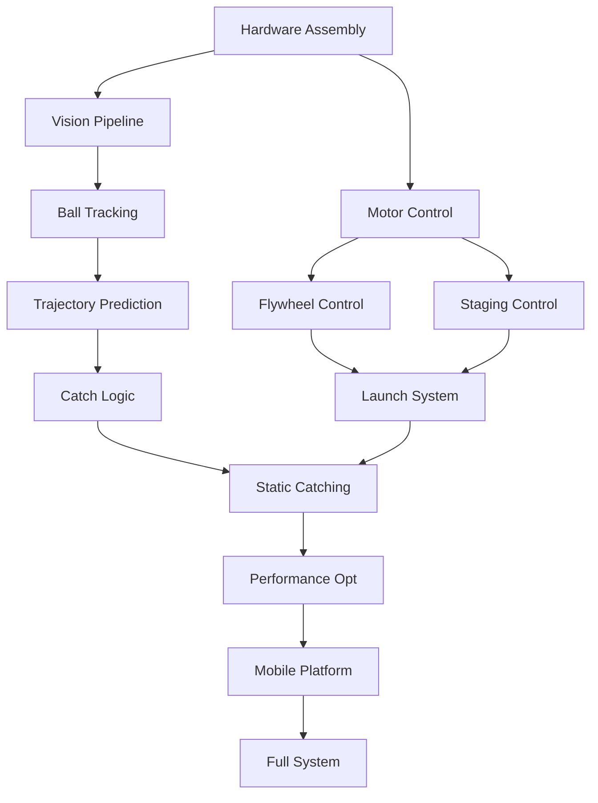

# John Stockbot - Detailed Development Timeline
*Autonomous Basketball Rebounding & Training Assistant*

## Week 1: Foundation Setup
### Hardware Tasks
- [ ] **Day 1-2**: Assemble flywheel system
  - Mount motors to frame
  - Install timing belts and pulleys
  - Verify wheel alignment and clearances
- [ ] **Day 2-3**: Build ball staging mechanism
  - Install stepper motor and lead screw
  - Test pushing plate movement
  - Verify ball feeding path
- [ ] **Day 3-4**: Camera mount assembly
  - Install tilt motor system
  - Mount ZED Mini securely
  - Cable management for USB-C

### Software Tasks
- [ ] **Day 1-2**: Development environment
  - Install ROS2 on Jetson
  - Set up CUDA toolkit
  - Configure ZED SDK
- [ ] **Day 3-4**: Basic communication
  - Teensy ↔ Jetson serial protocol
  - Test motor commands
  - Verify sensor data flow
- [ ] **Day 5**: Safety systems
  - Implement emergency stop
  - Add motor current limiting
  - Create watchdog timers

**Week 1 Deliverable**: All hardware assembled, basic software communication working

## Week 2: Subsystem Validation
### Vision Pipeline
- [ ] **Day 1-2**: Ball detection
  - Color segmentation in HSV space
  - Circle detection with Hough transform
  - Depth data integration
- [ ] **Day 3**: Tracking implementation
  - Kalman filter for ball state
  - Multi-frame association
  - FPS optimization

### Motor Control
- [ ] **Day 2-3**: Flywheel control
  - ESC initialization and calibration
  - Speed control via PWM
  - RPM sensing implementation
- [ ] **Day 4**: Stepper control
  - Teensy AccelStepper setup
  - Position feedback
  - Homing sequences

### Integration
- [ ] **Day 5**: First integration test
  - Vision → Jetson → Teensy → Motors
  - Measure end-to-end latency
  - Debug communication issues

**Week 2 Deliverable**: Individual subsystems tested and operational

## Week 3: Trajectory Prediction & Catching Logic
### Algorithm Development
- [ ] **Day 1-2**: Physics model
  - Implement projectile motion equations
  - Add air resistance compensation
  - Account for ball spin (Magnus effect)
- [ ] **Day 3**: Prediction refinement
  - Least squares trajectory fitting
  - Confidence scoring
  - Intercept point calculation

### Control Implementation
- [ ] **Day 3-4**: Catch sequence
  - State machine design
  - Timing synchronization
  - Ball containment verification
- [ ] **Day 5**: First catch attempts
  - Static drops from known height
  - Gentle tosses
  - Debug timing issues

**Week 3 Deliverable**: First successful ball catch from simple trajectory

## Week 4: Launch System & Basic Integration
### Flywheel Optimization
- [ ] **Day 1-2**: Launch characterization
  - Map RPM to launch distance
  - Test various ball compressions
  - Create lookup tables
- [ ] **Day 3**: Staging refinement
  - Optimize push speed
  - Ensure consistent ball position
  - Add ball presence detection

### System Integration
- [ ] **Day 4-5**: Full cycle testing
  - Detect → Track → Catch → Stage → Launch
  - Identify bottlenecks
  - Optimize state transitions

**Week 4 Deliverable**: Complete static robot catching and returning balls

## Week 5: Performance Optimization
### Catching Improvements
- [ ] **Day 1-2**: Trajectory accuracy
  - Multi-point trajectory fitting
  - Adaptive filter tuning
  - Earlier detection optimization
- [ ] **Day 3**: Success rate improvement
  - Analyze failure modes
  - Adjust intercept timing
  - Expand catch envelope

### Passing Accuracy
- [ ] **Day 4-5**: Launch precision
  - Closed-loop RPM control
  - Compensate for ball condition
  - Add aim adjustment for spin

**Week 5 Deliverable**: >85% catch rate, ±1.5m passing accuracy

## Week 6: Advanced Features & Testing
### Player Tracking
- [ ] **Day 1-2**: Human detection
  - Implement pose estimation
  - Track player position
  - Predict player movement
- [ ] **Day 3**: Adaptive passing
  - Adjust launch power for distance
  - Lead passing for moving players
  - Safety zones implementation

### Robustness Testing
- [ ] **Day 4-5**: Stress testing
  - Continuous operation tests
  - Various shot types and speeds
  - Edge case handling

**Week 6 Deliverable**: 90% catch rate achieved, player-aware passing

## Week 7: Mobility Platform
### Drivetrain Integration
- [ ] **Day 1-2**: Motor control
  - X-drive kinematics implementation
  - Individual wheel speed control
  - Odometry estimation
- [ ] **Day 3**: Basic navigation
  - Point-to-point movement
  - Rotation control
  - Acceleration profiles

### Mobile Interception
- [ ] **Day 4-5**: Path planning
  - Intercept point prediction
  - Optimal path calculation
  - Dynamic re-planning

**Week 7 Deliverable**: Mobile platform operational with basic intercepts

## Week 8: System Integration & Polish
### Full Integration
- [ ] **Day 1-2**: Mobile catching
  - Tune mobile intercept timing
  - Optimize positioning strategy
  - Handle platform motion during catch
- [ ] **Day 3**: System optimization
  - Code optimization for latency
  - Power management
  - Reliability improvements

### Documentation & Demo
- [ ] **Day 4**: Documentation
  - Code documentation
  - System operation guide
  - Troubleshooting guide
- [ ] **Day 5**: Demo preparation
  - Record demo videos
  - Prepare presentation
  - Final testing session

**Week 8 Deliverable**: Fully operational mobile basketball rebounding robot

## Critical Dependencies

## Daily Development Schedule
- **Morning (2-3 hrs)**: Hardware tasks, mechanical adjustments, testing
- **Afternoon (3-4 hrs)**: Software development, algorithm implementation
- **Evening (1-2 hrs)**: Integration testing, debugging, documentation

## Risk Management Buffer
- Week 3, 5, 7: Each has 1 day buffer for unexpected issues
- Week 8: 2 days buffer for final integration challenges