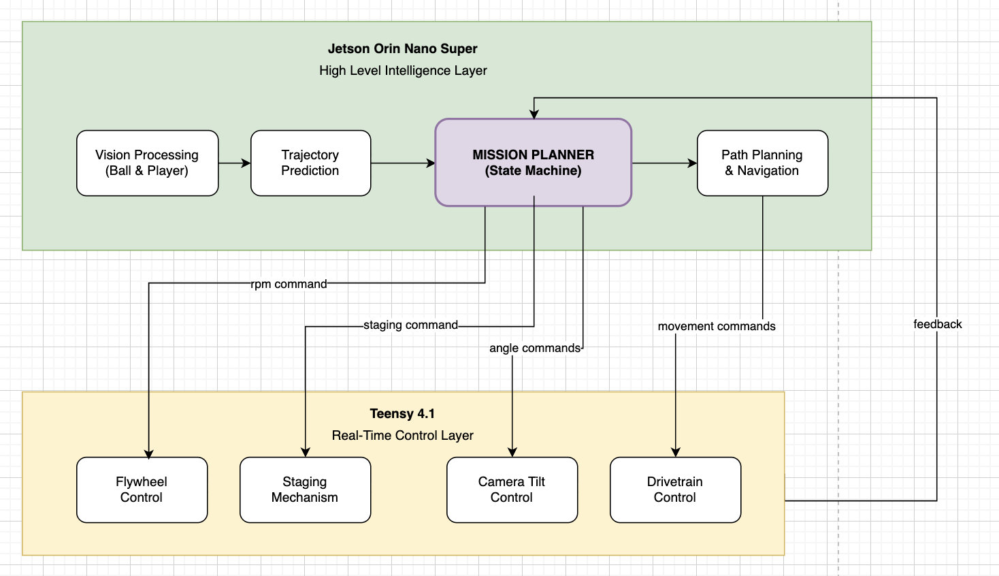

# John Stockbot - System Architecture

## Rationale

The system employs a** **hierarchical, distributed architecture combining high-level intelligence on the Jetson Orin Nano with real-time control on the Teensy 4.1. This separation removes computationally intensive vision processing from the Teensy’s precise but computationally constrained motor control capabilities, ensuring deterministic response times for safety-critical operations. The ROS2 framework provides standardized interfaces and tools for debugging, while the distributed nature ensures that a failure in one subsystem doesn't flow to others, improving overall system reliability.

## System Overview

## Layer 1: Perception & Intelligence (Jetson Orin Nano)

### Vision Processing Node

**Responsibility**: Process ZED Mini camera data for object detection and tracking

* **Input**: RGB-D and depth stream
* **Processing**:
    * Ball detection using color segmentation + Hough circles
    * Player detection using pose estimation (OpenPose or MediaPipe)
    * Court boundary detection via line detection
* **Output**: Object positions in 3D world coordinates
* **Update Rate**: 30 Hz minimum

### Trajectory Prediction Node

**Responsibility**: Calculate ball flight path and intercept point

* **Input**: Ball position history (last 5-10 frames)
* **Processing**:
    * Kalman filter for state estimation
    * Physics model with drag coefficient
    * Confidence scoring for predictions
* **Output**: Predicted intercept point and time
* **Update Rate**: 30 Hz

### Mission Planning Node

**Responsibility**: High-level decision making and state management

* **States**:
    1. IDLE - Waiting for ball detection
    2. TRACKING - Following ball trajectory
    3. INTERCEPTING - Moving to catch position
    4. CATCHING - Executing catch sequence
    5. STAGING - Preparing ball for launch
    6. AIMING - Calculating launch parameters
    7. LAUNCHING - Executing pass
* **Output**: State commands and target positions
* **Update Rate**: 10 Hz

### Path Planning Node (Mobile Configuration)

**Responsibility**: Calculate optimal paths for interception

* **Input**: Current position, target intercept point, obstacles
* **Algorithm**: A* or RRT* for real-time planning
* **Output**: Waypoint sequence for drivetrain
* **Update Rate**: 10 Hz

## Layer 2: Real-Time Control (Teensy 4.1)

### Communication Interface

* **Protocol**: Custom binary protocol over Serial
* **Message Types**:
    * Motor commands (position, velocity, acceleration)
    * Sensor requests (encoder, IMU, limit switches)
    * Status updates (faults, temperatures, battery)
* **Bandwidth**: ~10 KB/s at 100 Hz update rate

### Flywheel Controller

**Responsibility**: Manage dual-motor flywheel system

* **Control Mode**: Closed-loop RPM control via ESCs
* **Sensors**: Hall effect for RPM feedback
* **Safety**: Soft-start, over-current protection
* **Performance**: 0-6000 RPM in &lt;2 seconds

### Staging Mechanism Controller

**Responsibility**: Control ball feeding into flywheel

* **Actuator**: NEMA 17 stepper with TMC2209 driver
* **Control**: Position control with AccelStepper library
* **Feedback**: Limit switches for home/end positions
* **Sequence**: Home → Load → Stage → Push → Retract

### Drivetrain Controller (Mobile Configuration)

**Responsibility**: Execute omnidirectional movement

* **Configuration**: 4-wheel X-drive with omni wheels
* **Control**: Inverse kinematics for wheel speeds
* **Feedback**: Encoder-based odometry
* **Performance**: 2 m/s max speed, 1 m/s² acceleration

### Camera Tilt Controller

**Responsibility**: Tilt camera for optimal tracking

* **Actuator**: NEMA 17 stepper motor
* **Control**: Position tracking of ball trajectory
* **Update Rate**: 50 Hz

## Scalability & Future Enhancements

### Modular Expansions

* LIDAR obstacle detection for navigation
* Speaker and microphone for user interaction

### Software Enhancements

* Shot prediction from player pose
* Handle and stage multiple balls simultaneously