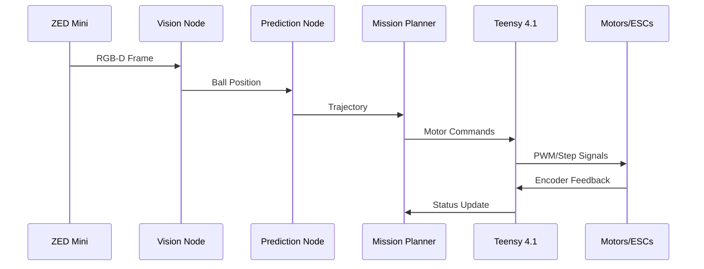

# John Stockbot - System Architecture
*Autonomous Basketball Rebounding & Training Assistant*

## Architecture Rationale

The John Stockbot system employs a **hierarchical, distributed architecture** combining high-level intelligence on the Jetson Orin Nano with real-time control on the Teensy 4.1. This design was chosen for several critical reasons: First, it separates computationally intensive vision processing from time-critical motor control, ensuring deterministic response times for safety-critical operations. Second, it leverages the strengths of each platform - the Jetson's GPU for neural networks and computer vision, and the Teensy's real-time capabilities for precise motor control. Third, the modular design allows parallel development and independent testing of subsystems, crucial for a solo developer working on a tight timeline. The ROS2 framework provides standardized interfaces and tools for debugging, while the distributed nature ensures that a failure in one subsystem doesn't cascade to others, improving overall system reliability.

## System Overview

```
┌─────────────────────────────────────────────────────────────┐
│                     High-Level Intelligence                  │
│                    (Jetson Orin Nano Super)                 │
│  ┌──────────┐ ┌──────────┐ ┌──────────┐ ┌──────────────┐  │
│  │  Vision  │ │Trajectory│ │ Mission  │ │Path Planning │  │
│  │Processing│ │Prediction│ │ Planner  │ │& Navigation  │  │
│  └──────────┘ └──────────┘ └──────────┘ └──────────────┘  │
│                        ROS2 Framework                        │
└─────────────────────────────────────────────────────────────┘
                            │
                   Serial/USB Connection
                         (115200 baud)
                            │
┌─────────────────────────────────────────────────────────────┐
│                    Real-Time Control Layer                   │
│                        (Teensy 4.1)                         │
│  ┌──────────┐ ┌──────────┐ ┌──────────┐ ┌──────────────┐  │
│  │ Flywheel │ │ Staging  │ │Drivetrain│ │Camera Gimbal │  │
│  │  Control │ │Mechanism │ │  Control │ │   Control    │  │
│  └──────────┘ └──────────┘ └──────────┘ └──────────────┘  │
│                     Safety & Watchdog                        │
└─────────────────────────────────────────────────────────────┘
```

## Layer 1: Perception & Intelligence (Jetson Orin Nano)

### Vision Processing Node
**Responsibility**: Process ZED Mini camera data for object detection and tracking
- **Input**: RGB-D stream at 720p, 60 FPS
- **Processing**:
  - Ball detection using color segmentation + Hough circles
  - Player detection using pose estimation (OpenPose or MediaPipe)
  - Court boundary detection via line detection
- **Output**: Object positions in 3D world coordinates
- **Update Rate**: 30 Hz minimum

### Trajectory Prediction Node
**Responsibility**: Calculate ball flight path and intercept point
- **Input**: Ball position history (last 5-10 frames)
- **Processing**:
  - Kalman filter for state estimation
  - Physics model with drag coefficient
  - Confidence scoring for predictions
- **Output**: Predicted intercept point and time
- **Update Rate**: 30 Hz

### Mission Planning Node
**Responsibility**: High-level decision making and state management
- **States**:
  1. IDLE - Waiting for ball detection
  2. TRACKING - Following ball trajectory
  3. INTERCEPTING - Moving to catch position
  4. CATCHING - Executing catch sequence
  5. STAGING - Preparing ball for launch
  6. AIMING - Calculating launch parameters
  7. LAUNCHING - Executing pass
- **Output**: State commands and target positions
- **Update Rate**: 10 Hz

### Path Planning Node (Mobile Configuration)
**Responsibility**: Calculate optimal paths for interception
- **Input**: Current position, target intercept point, obstacles
- **Algorithm**: A* or RRT* for real-time planning
- **Output**: Waypoint sequence for drivetrain
- **Update Rate**: 10 Hz

## Layer 2: Real-Time Control (Teensy 4.1)

### Communication Interface
- **Protocol**: Custom binary protocol over Serial
- **Message Types**:
  - Motor commands (position, velocity, acceleration)
  - Sensor requests (encoder, IMU, limit switches)
  - Status updates (faults, temperatures, battery)
- **Bandwidth**: ~10 KB/s at 100 Hz update rate

### Flywheel Controller
**Responsibility**: Manage dual-motor flywheel system
- **Control Mode**: Closed-loop RPM control via ESCs
- **Sensors**: Hall effect for RPM feedback
- **Safety**: Soft-start, over-current protection
- **Performance**: 0-6000 RPM in <2 seconds

### Staging Mechanism Controller
**Responsibility**: Control ball feeding into flywheel
- **Actuator**: NEMA 17 stepper with TMC2209 driver
- **Control**: Position control with AccelStepper library
- **Feedback**: Limit switches for home/end positions
- **Sequence**: Home → Load → Stage → Push → Retract

### Drivetrain Controller (Mobile Configuration)
**Responsibility**: Execute omnidirectional movement
- **Configuration**: 4-wheel X-drive with omni wheels
- **Control**: Inverse kinematics for wheel speeds
- **Feedback**: Encoder-based odometry
- **Performance**: 2 m/s max speed, 1 m/s² acceleration

### Camera Gimbal Controller
**Responsibility**: Orient camera for optimal tracking
- **Actuator**: NEMA 17 for tilt axis
- **Range**: -30° to +60° tilt
- **Control**: Position tracking of ball trajectory
- **Update Rate**: 50 Hz

## Inter-Process Communication

### ROS2 Topics Structure
```
/perception/ball_detection      - sensor_msgs/PointCloud2
/perception/player_pose         - geometry_msgs/PoseArray
/prediction/ball_trajectory     - custom_msgs/Trajectory
/planning/mission_state         - custom_msgs/MissionState
/control/motor_commands         - custom_msgs/MotorCommand
/control/motor_feedback         - custom_msgs/MotorFeedback
/system/diagnostics            - diagnostic_msgs/DiagnosticArray
```

### Communication Flow


## Data Flow & Timing

### Critical Path Latencies
- Camera → Ball Detection: 20ms
- Ball Detection → Trajectory: 10ms
- Trajectory → Mission Decision: 5ms
- Mission → Teensy Command: 5ms
- Teensy → Motor Response: 10ms
- **Total: 50ms end-to-end**

### Control Loop Frequencies
- Vision Processing: 30 Hz
- Trajectory Updates: 30 Hz
- Mission Planning: 10 Hz
- Motor Control: 100 Hz
- Safety Monitoring: 1000 Hz

## Fault Tolerance & Safety

### Failure Modes
1. **Vision Loss**: Immediate stop, maintain last known state
2. **Communication Loss**: Teensy enters safe mode after 100ms
3. **Motor Fault**: Disable affected subsystem, alert operator
4. **Power Loss**: Controlled shutdown, brake motors

### Safety Systems
- **Hardware E-Stop**: Physical button bypassing all software
- **Software Watchdog**: Teensy monitors Jetson heartbeat
- **Current Limiting**: Prevent motor burnout
- **Boundary Detection**: Virtual walls for court limits
- **Proximity Detection**: Stop if human too close to moving parts

## Development & Debugging Infrastructure

### Simulation Environment
- **Gazebo**: Physics simulation for trajectory testing
- **RViz**: Visualization of perception and planning
- **PlotJuggler**: Real-time data plotting

### Logging & Diagnostics
- **ROS2 Bags**: Record all topics for replay
- **Teensy Serial**: Debug output at 115200 baud
- **System Metrics**: CPU, GPU, memory, temperature monitoring

### Testing Interfaces
- **Manual Override**: Direct motor control via gamepad
- **Trajectory Injection**: Test with synthetic ball paths
- **Component Testing**: Individual node testing framework

## Scalability & Future Enhancements

### Modular Expansions
- **Dual Camera**: Stereo vision for better depth
- **IMU Integration**: Better mobile platform odometry
- **LIDAR**: Obstacle detection for navigation
- **Audio Feedback**: Speaker for user interaction

### Performance Upgrades
- **GPU Acceleration**: TensorRT for neural networks
- **FPGA Co-processor**: Ultra-low latency trajectory
- **Better Motors**: Brushless for drivetrain efficiency

### Software Enhancements
- **Machine Learning**: Shot prediction from player pose
- **Multi-Ball Tracking**: Handle multiple balls simultaneously
- **Adaptive Control**: Learn optimal parameters over time